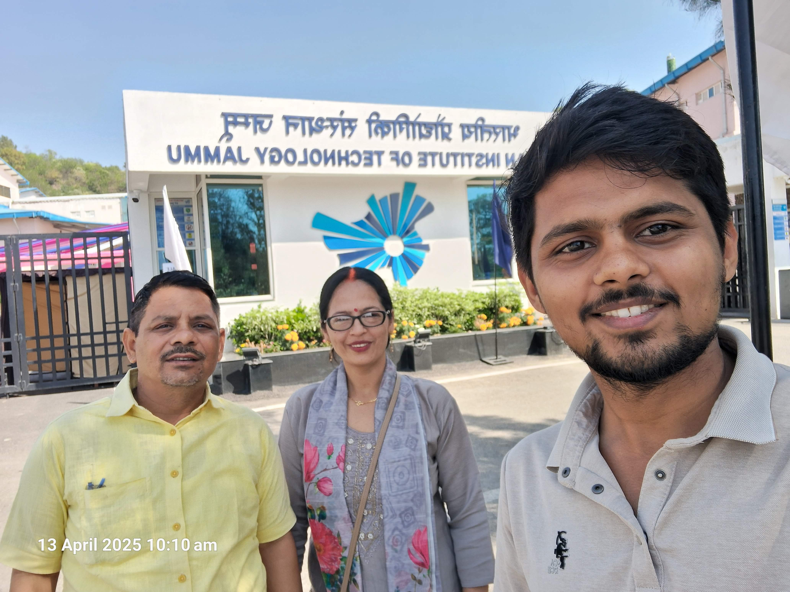
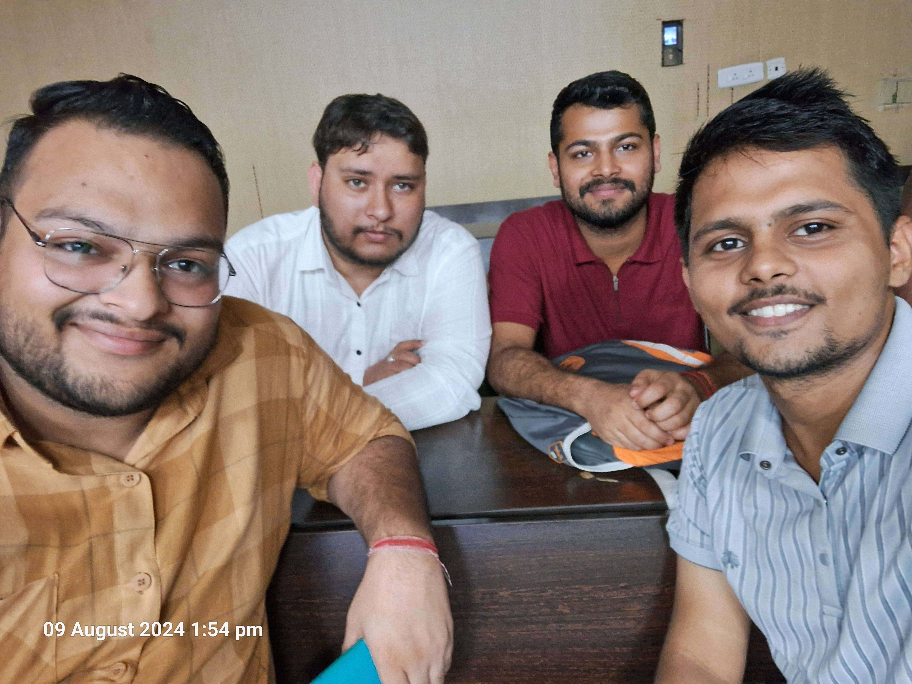
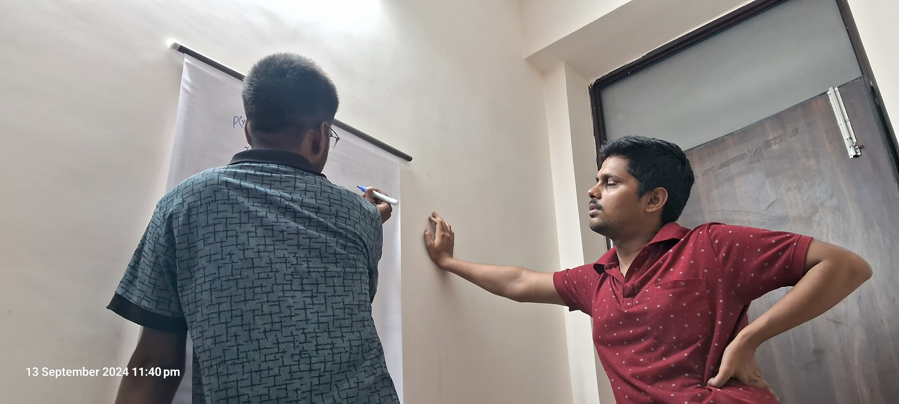
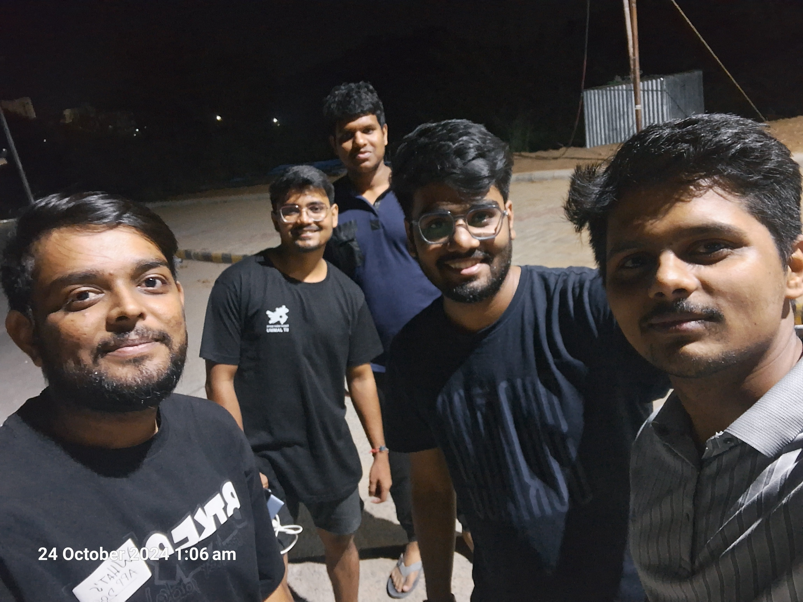
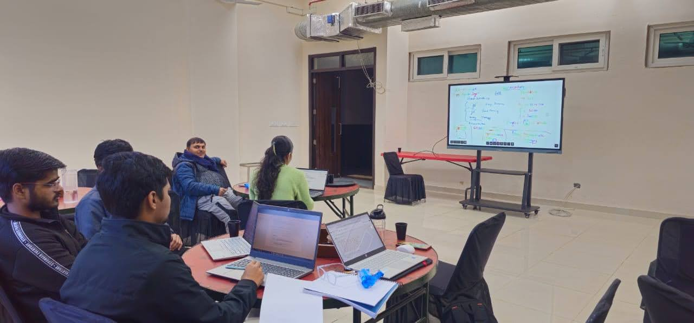
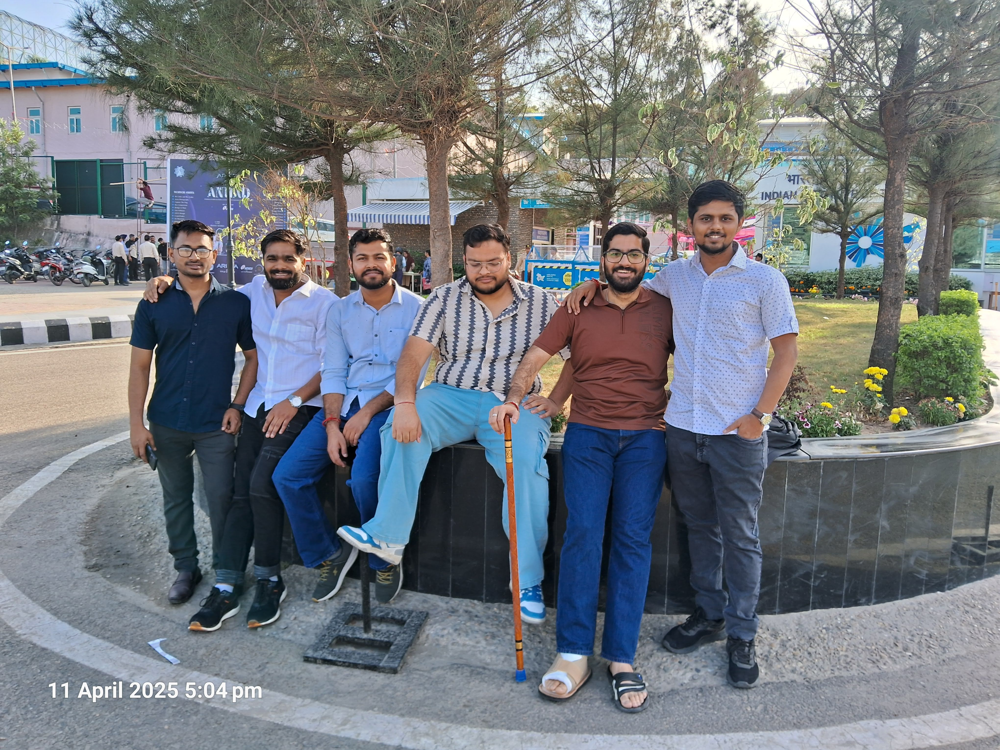

# **My Life at IIT Jammu: Countless Lessons**

Walking through the gates of an IIT for the first time felt surreal—like stepping into a world I'd only imagined from afar. After years of grinding through diploma labs and self-driven projects, I had made it. But making it in was just the beginning.

## ⚙️ The Culture Shock

The first few weeks were overwhelming. Surrounded by some of the sharpest minds in the country, I quickly realized this wasn’t just about academics—it was a whole ecosystem. Everyone had a story, a project, an internship, a startup idea. I came in with embedded systems and low-level programming. Others came in with Olympiads, CP badges, research papers.

It was intimidating. But it was also inspiring.

*First week—overwhelmed but inspired*

## 🧠 Learning, Relearning, and Unlearning

I had to adapt—not just academically, but mentally. I realized that depth matters just as much as breadth. While I had built things before, here I was encouraged to ask why, not just how. Whether it was dissecting operating systems or refining algorithms, everything was about fundamentals.

And then came group projects, late-night debugging marathons, and the joy of learning from peers who saw the same problem from a completely different angle.

*Not just classes—learning happens everywhere*

## 🔬 Beyond the Classroom

The real charm of IIT life is what happens outside lectures. I explored clubs, attended tech talks, and even ended up diving deeper into Low Resource NLP—a field I hadn’t expected to touch. I met people working on things I hadn’t even heard of before, and those conversations often taught more than any textbook.

I also refined my old passions—bitwise programming, cryptography, hardware debugging—but with better tools, sharper questions, and peer feedback that pushed me to do better.

*One of those nights—Maggi, coffee, and campus.*

## 📉 Failures, Deadlines & That One All-Nighter

Not everything went smoothly. There were deadlines I missed, grades I wasn’t proud of, and moments I wondered if I belonged. But every failure was a checkpoint, not the end. I learned to manage expectations, say no, and most importantly, take care of myself.

And yes, there was that one all-nighter with Maggi, git conflicts, and a presentation that crashed 5 minutes before the demo. Wouldn’t trade it for anything.

*Still walking this journey—one step at a time.*

## 🛤️ The Journey Ahead
It’s only been a year, but I feel like I’ve changed. I’m still the same curious developer who loves low-level code—but now with broader horizons, a stronger foundation, and a clearer sense of direction. IIT didn’t just challenge me technically—it pushed me to grow as a learner, teammate, and person.

*Still walking this journey—one step at a time.*
